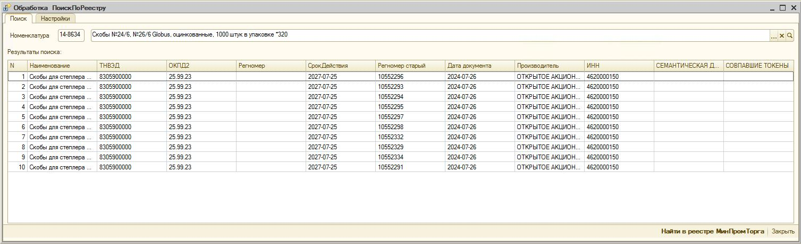

# Поиск товаров в реестре - Обработка для 1С:Предприятие 8.2 обычнное приложение толстый клиент
Внешняя обработка для поиска товаров в реестре минпромторга

## Скриншот обработки



## Реквизиты формы
**Обязательные реквизиты:**
- `Артикул` (Строка) - информационно
- `АдресAPI` (Строка) - например: `192.168.201.187:3333`
- `ТокенAPI` (Строка) - токен для авторизации в api
- `Номенклатура` (СправочникСсылка.Номенклатура)

**Табличная часть `ТаблицаТоваров`:**
| Имя колонки | Тип | Заголовок | Описание | **Длина** |
|-------------|-----|-----------|----------|----------|
| ProductName | Строка | Наименование | Название товара | **0** (неограниченно) |
| TNVED | Строка | ТН ВЭД | Код ТН ВЭД | 10 |
| OKPD2 | Строка | ОКПД2 | Код ОКПД2 | 10 |
| RegNumber | Строка | Регномер | Номер свидетельства о регистрации | 20 |
| ExpiryDate | Строка | Срок действия | Срок действия регистрации | 10 |
| OldRegNumber | Строка | Регномер старый | Старый номер регистрации | 20 |
| DocDate | Строка | Дата документа | Дата выдачи документа | 10 |
| Manufacturer | Строка | Производитель | Название организации | **0** (неограниченно) |
| INN | Строка | ИНН | ИНН производителя | 20 |
| Distance | Строка | Дистанция | Расстояние при поиске | 10 |
| TokenMatches | Строка | Совпадения токенов | Количество совпадений | 10 |


## Как работает

1. Пользователь выбирает Номенклатуру из справочника
2. Нажимает "Найти в реестре"
3. Отправляется POST запрос на `/api/chat/completions`
4. API возвращает товары из реестра в формате JSON
5. Таблица заполняется найденными товарами

## Структура ответа API

```json
{
  "choices": [{
    "message": {
      "content": "{\"results\": [{\"product_name\": \"...\", \"tnved\": \"...\", ...}]"
    }
  }]
}
```
