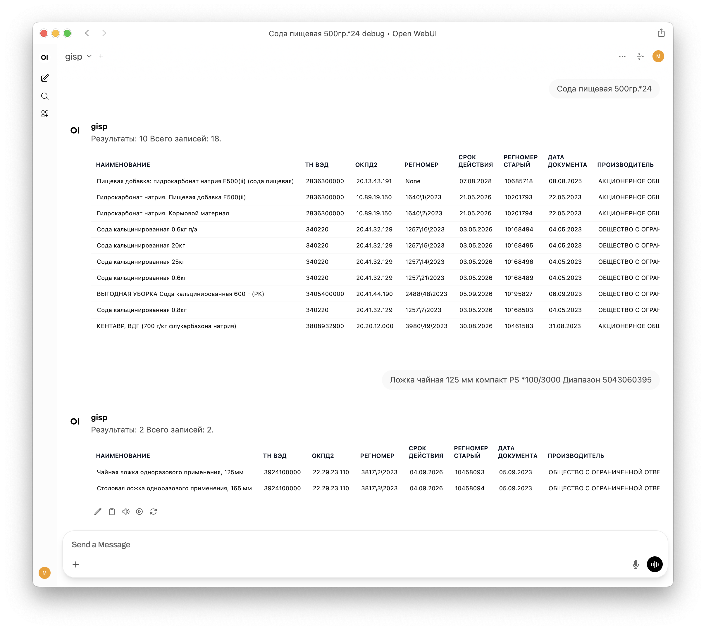

ГИСП реестр API И Чат для поиска

Решение разворачивает полный контур работы с реестром Минпромторга: PostgreSQL с готовой структурой, FastAPI‑шлюз, семантический сервис и чат-интерфейс на базе OpenWebUI. Контейнер `import` автоматически скачивает свежие CSV каждую ночь, пишет логи, чистит старые файлы и прогревает базу (VACUUM/pg_prewarm). Вы получаете поиск двумя способами: строгие фильтры по `/reestr` и разгоxnjворный семантический режим (`semantic|…`) с расширением синонимами — по умолчанию Pipe комбинирует оба источника и выводит результаты в едином списке. Подробности выбора режима описаны в разделе [Описание параметров в чате](#описание-параметров-в-чате). Всё работает на CPU, без внешних зависимостей — достаточно  настроить `.env` и запустить `docker compose up`.

<picture>
  <source media="(prefers-color-scheme: dark)" srcset="docs/chat-dark.png">
  <source media="(prefers-color-scheme: light)" srcset="docs/chat-light.png">
  
</picture>

# Установка

1. Клонируйте репозиторий и перейдите в каталог проекта:
   ```bash
   git clone https://github.com/0x3654/gisp.git
   cd gisp
   ```
2. Создайте локальные конфиги из примеров:
   ```bash
   cp .env.example .env
   cp services/semantic/synonyms.example.json services/semantic/synonyms.json
   ```
3. Заполните `.env` реальными значениями:
   - `POSTGRES_*` — креды PostgreSQL (используются API, импортером и воркерами).
   - `BOT_TOKEN`/`CHAT_ID` — опциональные параметры для уведомлений Telegram.
   - `FILES_DIR`, `LOG_DIR`, `MAX_*` — каталоги и политики очистки для контейнера `import`.
   - `SEMANTIC_CACHE_TTL_SECONDS` — сколько секунд хранить кэшированное представление своих запросов семантического сервиса (по умолчанию 7 суток).
4. Отредактируйте `services/semantic/synonyms.json`, добавив свои пары «термин → список синонимов».
   > Пример:
   ```json
   {
     "сода": ["гидрокарбонат натрия", "пищевая сода"]
   }
   ```
5. Запустите стек:
   ```bash
   docker compose up -d --build postgres_registry api import semantic openwebui
   ```
   После правок чат-скрипта синхронизируйте функцию:
   ```bash
   ./scripts/run_openwebui_sync.sh
   ```


# **Структура проекта**

Контейнеры и их Dockerfile'ы лежат в каталоге `services/<name>` (api, import, semantic, openwebui и т.д.).
<!-- Схема обработки сообщений и взаимодействия с API (Excalidraw): см. файл docs/workflow.excalidraw -->

<picture>
  <source media="(prefers-color-scheme: dark)" srcset="docs/scheme-dark.png">
  <source media="(prefers-color-scheme: light)" srcset="docs/scheme-light.png">
  
</picture>

> ## **Контейнер registry-pg**
>
> База данных PostgreSQL с данными из реестра Минпромторга
>
> <details>
> <summary><b>Таблица: reestr   - основное хранилище данных реестра</b></summary>
>
> Поля:
> - `source_file`
> - `nameoforg`
> - `ogrn`
> - `inn`
> - `orgaddr`
> - `productmanufaddress`
> - `regnumber`
> - `ektrudp`
> - `docdate`
> - `docvalidtill`
> - `enddate`
> - `registernumber`
> - `productname`
> - `okpd2`
> - `tnved`
> - `nameofregulations`
> - `score`
> - `percentage`
> - `scoredesc`
> - `iselectronicproduct`
> - `isai`
> - `electronicproductlevel`
> - `docname`
> - `docdatebasis`
> - `docnum`
> - `docvalidtilltpp`
> - `mptdep`
> - `resdocnum`
>
> </details>
>
> <details>
> <summary><b>Таблица: semantic_items — кэш эмбеддингов для семантического поиска</b></summary>
>
> Поля:
> - `reestr_id` — ссылка на запись в `reestr`
> - `normalized_text` — нормализованный текст
> - `synonyms` — синонимы (JSON)
> - `embedding` — вектор признаков (pgvector)
> - `updated_at` — время последнего обновления
>
> </details>
>
> <details>
> <summary><b>Таблица: load_log - лог загрузки CSV-файлов</b></summary>
>
> Поля:
> - `file_name`
> - `file_size`
> - `file_sha256`
> - `loaded_at`
> - `rows_inserted`
> </details>
>
> <details>
> <summary><b>Таблица: semantic_query_cache — кэш запросов (embeddings)</b></summary>
>
> Поля:
> - `query_hash` — хэш текста
> - `original_text` / `normalized_text` — исходный и нормализованный запрос
> - `embedding` — сохранённый вектор (pgvector)
> - `created_at`, `expires_at` — TTL (управляется `SEMANTIC_CACHE_TTL_SECONDS`)
>
> </details>
---
> ## **Контейнер registry-web**
> Контейнер с **API** и **веб-интерфейсом** на порту **8000**
> - При запуске контейнера и по расписанию раз в сутки выполняется скрипт, который:
>   - Проверяет и скачивает файлы CSV с сайта
>   - Загружает их в базу данных
> - Логи и статус загрузки **отправляются в Telegram**
 ---
> ## **Контейнер openwebui**
> Веб-интерфейс с обработкой запроса в чате, нормализацией параметров, запросом в базу через API и выводом ответа в чат в удобном формате
> Автоматически парсит сообщение и нормализует параметры. Подробное описание — [см. раздел II. Обработка сообщений в чате](#ii-обработка-сообщений-в-чате)
>
>  **После правок `services/openwebui/tools/reestr_openwebui.py` перезапустите `openwebui-sync` — это выполнит синхронизацию внутри контейнера и очистит кеш функции.**
 ---
> ## **Контейнер semantic**
> Строит эмбеддинги для семантического поиска по реестру. Использует компактную мультиязычную модель (`paraphrase-multilingual-MiniLM-L12-v2`, ~500 МБ) и расширяет запросы синонимами из `services/semantic/synonyms.json`. Модель скачивается один раз при сборке образа и кэшируется в каталоге `services/semantic/model`, так что повторные рестарты не тянут сеть. Работает на CPU, поэтому не требует GPU и отвечает детерминированно.

# I. **FastAPI Web API**
> ### Эндпоинт: GET `/reestr`
<details>
<summary><b>Параметры запроса:</b></summary>

> | Параметр      | Тип    | Описание                                                                 |
> |---------------|--------|--------------------------------------------------------------------------|
> | `inn`         | `str`  | ИНН организации|
> | `tnved`       | `str`  | Код ТНВЭД|
> | `okpd2`       | `str`  | Код ОКПД2                                                              |
> | `productname` | `str`  | Наименование продукта, поддержка `$` для обязательных терминов и `^` для альтернативных |
> | `regnumber`   | `str`  | Регистрационный номер, формат "244\4\2023"                            |
> | `nameoforg`   | `str`  | Название организации.                                                   |
> | `code`        | `str`  | Универсальный код, ищет и по ИНН, и по ТНВЭД                         |
> | `limit`       | `int`  | Количество записей (по умолчанию 20, максимум 200 — регулируется `REESTR_*` в `.env`) |
> | `offset`      | `int`  | Смещение (по умолчанию 0, неотрицательное)                             |
</details>

 ---

> **Описание работы:**
> - Формирует SQL-запрос с фильтрами по переданным параметрам
> - Параметр `code` ищется и по ИНН, и по ТНВЭД
> - Параметр `productname` разбивается по `$` (все термины должны присутствовать) и `^` (любой из вариантов), каждая часть ищется через `ILIKE`
> - Параметр `regnumber` нормализуется (обратный слэш)
> - Результат ограничивается параметрами `limit` и `offset`

> **Возвращаемый JSON:**
> ```json
> {
>   "rows": [...],
>   "limit": 20,
>   "offset": 0,
>   "count": 20
> }
> ```

---

> ### Эндпоинт: GET `/reestr/semantic`
<details>
<summary><b>Параметры запроса:</b></summary>

> | Параметр    | Тип   | Описание |
> |-------------|-------|----------|
> | `text`      | `str` (**обязателен**) | Свободный запрос пользователя, тот же текст, что вводится в чат (`semantic|…`) |
> | `limit`     | `int` | Количество записей (1–100, по умолчанию 10) |
> | `offset`    | `int` | Смещение результата (>=0) |
> | `inn` / `tnved` / `okpd2` / `regnumber` / `nameoforg` / `code` | как в `/reestr` | Дополнительные фильтры, применяются после семантического ранжирования |
</details>

---

> **Описание работы:**
> - API запрашивает embedding у контейнера `semantic_service`, где запрос очищается, нормализуется и расширяется синонимами из `services/semantic/synonyms.json`.
> - Выполняется прогрессивный поиск по таблице `registry.semantic_items` с fallback-листом:
>   - Начальное ограничение `limit*2`, затем (если результатов мало) лимит удваивается до 800 строк.
>   - При необходимости TНВЭД «усекается» (10→8→6→4) или полностью отключается, чтобы избежать пустых выборок.
> - Результаты агрегируются с учётом наложенных фильтров (`inn`, `okpd2`, …) и сортируются по косинусной дистанции (`embedding <=> query`).
> - Повторные запросы к одному и тому же тексту берут embedding из кэша PostgreSQL (`registry.semantic_query_cache`, TTL задаётся `SEMANTIC_CACHE_TTL_SECONDS`).

> **Возвращаемый JSON (сокращённо):**
> ```json
> {
>   "rows": [
>     {
>       "productname": "...",
>       "distance": 0.1372,
>       "token_matches": 5,
>       "...": "..."
>     }
>   ],
>   "limit": 10,
>   "offset": 0,
>   "count": 10,
>   "semantic": {
>     "original_query": "Сода пищевая 500гр.*24",
>     "normalized_query": "сода пищевая 500гр 24",
>     "synonyms": ["гидрокарбонат натрия"],
>     "tokens": ["сода", "пищевая", "500гр", "*24"],
>     "fallback_attempts": [
>       {"label": "original", "rows": 20, "limit_used": 20, "elapsed": 1.2}
>     ],
>     "fallback_used": false,
>     "active_filters": {
>       "inn": null,
>       "tnved": null,
>       "okpd2": null,
>       "regnumber": null,
>       "code": null
>     }
>   }
> }
> ```

> **Когда использовать:** если нужно быстро найти товары по похожему описанию (парафраз), а не вручную перебирать `productname` и `tnved`. В чат-скрипте это команда `semantic|<текст>` или её короткая форма `сима|<текст>`.

---

# II. Обработка сообщений в чате
> 1. **Получение текста**
>  - Метод [`pipe()`](#pipebody-dict) берёт список сообщений из `body["messages"]`
>   - Извлекается последнее сообщение пользователя с ролью `role="user"`
>   - Текст сообщения сохраняется в переменную `text`

>2. **Определение флагов управления**
>   - Проверяется, включён ли `debug` ([`_extract_debug_flag`](#_extract_debug_flagtext)) — для вывода отладки
>   - Определяется `max_rows` ([`_extract_max_rows`](#_extract_max_rowstext)) — максимальное количество строк для вывода
>   - Из текста удаляются строки управления (`debug`, `max_rows`) через [`clean_control_params`](#clean_control_paramstext)
>   - Удаляются строки с ключевыми словами и ссылками через [`_strip_debug_lines`](#_strip_debug_lines)

>3. **Извлечение явных параметров**
>   - Метод [`_extract_explicit`](#_extract_explicittext) ищет в тексте:
>     - `INN` (`инн`, `inn`)
>     - `TNVED` (`tnved`, `тнвэд`, `тнвед`)
>     - `OKPD2` (`okpd2`, `окпд2`)
>     - `REGNUMBER` (`regnumber`, `регномер`)
>     - Наименование продукта (`productname`, `товар`, `наименование`)
>   - Найденные значения сразу добавляются в словарь `params`

>4. **Очистка текста**
>   - Из текста удаляются все ключи из `ALL_KEYS` и их варианты (например, слова "инн", "tnved", "окпд2" и т.п.), чтобы они не попали в `productname`
>   - `OKPD2` также вырезается из текста до формирования `productname`

>5. **Формирование параметров поиска**
>   - Если явного `productname` нет — оставшийся текст после удаления ключей и чисел берётся как `productname`
>   - Определяются кандидаты для:
>     - `inn` — числа 10–12 цифр с проверкой контрольной суммы
>     - `tnved` — числа 4, 6, 8, 10 цифр, которые не подошли как `INN`
>   - Если найден один 10-значный код — он используется как `code`, и `inn`/`tnved` не добавляются
>   - Если найден только `INN` или только `TNVED` — создаётся `code` с удалением исходных `inn`/`tnved`
>   - Итоговые параметры сохраняются в `params`, добавляются `max_rows` и флаг `debug`

>6. **Подготовка запроса к API**
>   - В `params_to_send` помещаются только найденные параметры: `code`, `inn`, `tnved`, `okpd2`, `productname`, `regnumber`
>   - Строки и списки объединяются через `|` для передачи нескольких значений

>7. **Отправка запроса и fallback**
>   - Первый запрос к API отправляется с текущими `params_to_send
>   - Если ничего не найдено:
>     1. Если есть `code`, он считается как `TNVED`, и пробуются сокращения TNVED 10→8→6→4
>     2. Если есть `TNVED`, пробуются сокращения TNVED 8→6→4
>   - Все попытки и результаты сохраняются в `fallback_debug` для отображения в отладке

>8. **Формирование ответа**
>   - Результат API нормализуется через [`_normalize_rows`](#_normalize_rowspayload) (список словарей и мета-информация)
>   - Таблица формируется через [`_format_table`](#_format_tablerows-meta-max_rows):
>     - Заголовки столбцов переименовываются через `FIELD_RENAME`
>     - Даты (`docdate`, `docvalidtill`) приводятся к формату `DD.MM.YYYY`
>   - Если результатов нет — выводится сообщение:
>     > "Ничего не найдено по заданным критериям."
>   - Если включён `debug`, возвращается блок с:
>     - Перечнем fallback-попыток
>     - Итоговыми параметрами запроса
>   - Иначе возвращается только таблица с результатами

>9. **Дополнительные операции**
>   - Разделение `productname`: `$` — логическое И, `^` — логическое ИЛИ
>   - Проверка корректности ИНН
>   - Нормализация регистрационных номеров
>   - Очистка лишних символов и переносов из текста


# III. Chat Pipe (`reestr_openwebui.py`)

>Класс `Pipe` обрабатывает текстовые сообщения и подготавливает параметры для API

### Методы

#### `_detect_data_type(text: str) -> dict`
>- Извлекает параметры: `inn`, `tnved`, `okpd2`, `regnumber`, `productname`, `code`
>- Распознаёт `OKPD2` до формирования `productname`
>- Если найден единичный 10-значный код — он считается `code`
>- Формирует итоговый словарь `params` с флагом `debug` и параметром `max_rows`

#### `pipe(body: dict)`

>- Основной метод обработки сообщений
>- Парсит текст пользователя
>- Выполняет запрос к API (`/reestr`)
>- Реализует fallback: преобразование `code` в `tnved` с сокращениями (10→8→6→4), а также сокращения TNVED (8→6→4)
>- Возвращает Markdown-таблицу с переименованными заголовками (`FIELD_RENAME`)
>- При включённом `debug` выводит все попытки fallback и параметры запроса
>- Команда `semantic|…` (или `сима`) выполняет поиск ближайших наименований по эмбеддингам:
>  - текст кодируется «как есть», затем расширяется синонимами (например, «сода пищевая» → «гидрокарбонат натрия») из `services/semantic/synonyms.json`;
>  - результаты ранжируются по количеству совпавших токенов и косинусной дистанции;
>  - строки без совпадений по токенам отбрасываются для предсказуемой выдачи.
>  Используется лёгкая лингвистическая модель на CPU — ответы приходят быстро, без участия LLM и без требований к GPU.

### Описание параметров в чате

По умолчанию Pipe сначала строит фильтры и обращается к `/reestr`; семантика подключается только если остаётся «лишний» текст или если пользователь явно набрал `semantic|`. Поэтому, чтобы выполнить исключительно структурный запрос:
- задавайте параметры в явном виде (каждая пара "параметр: значение" на новой строке или через пробел):
  - `inn:` / `инн:`
  - `tnved:` / `тнвед:` / `тнвэд:` / `тн вэд:`
  - `okpd2:` / `окпд2:`
  - `regnumber:` / `регномер:` / `регистрационный номер:`
  - `productname:` / `product:` / `name:` / `товар:` / `продукт:` / `наименование:` / `артикул:`
  - `nameoforg:` / `организация:` / `organization:`
  - `code:` (универсальный код для INN/TNVED)
  - `semantic|` (для чистого семантического режима);
  пример: `inn:6617025849 tnved:340220 productname:"сода кальцинированная"`;
- или используйте формат `regnumber:1257\16\2023` / `code:6617025849` — наличие `regnumber` всегда отключает семантический блок;
- не добавляйте произвольный текст вне параметров и не используйте префикс `semantic|`, если нужны только фильтры.
- дополнительные управляющие слова:
  - `debug:on` / `debug` — включает краткий блок «Отладка (кратко)» с последними фильтрами и fallback’ами;
  - `debug:full` — добавляет JSON-ответ API/семантики целиком;
  - `debug:summary` / `debug short` — выводит только текстовое резюме без JSON;
  - `debug:off` — принудительно скрывает отладку даже если она включена по умолчанию;
  - `max:20` / `rows:50` — задаёт количество строк в таблице (аналог `limit`);
  - `semantic|` (`семантик|`, `сима|`) — принудительно запускает только семантический поиск.


##### Словарь синонимов
- Расположен в `services/semantic/synonyms.json` и содержит пары вида `"ключевое слово": ["вариант1", "вариант2"]`.
- Храните ключи и значения в нижнем регистре, чтобы совпадения учитывались независимо от исходного написания.
- После правок пересоберите `semantic_service` (`docker compose build semantic && docker compose up -d semantic`), чтобы обновить кэш модели.
- OpenWebUI автоматически подхватит новые синонимы: дополнительные запросы (например, «сода» → «гидрокарбонат натрия») пойдут в работу сразу после пересборки контейнера.

#### `_format_table(rows, meta, max_rows)`

> - Формирует таблицу в формате Markdown
> - Заголовки столбцов переименовываются с помощью `FIELD_RENAME`
> - Даты (`docdate` и `docvalidtill`) форматируются в `DD.MM.YYYY`

#### `_normalize_rows(payload)`

> - Преобразует ответ API в список словарей и мета-информацию

#### `_extract_explicit(text)`

> - Извлекает явные параметры из текста:
>   - `INN` (`инн`, `inn`)
>   - `TNVED` (`tnved`, `тнвэд`, `тнвед`)
>   - `OKPD2` (`okpd2`, `окпд2`)
>   - `REGNUMBER` (`regnumber`, `регномер`)
>   - Наименование продукта (`productname`, `товар`, `наименование`)
>   - `Nameoforg` (`nameoforg`, `организация`, `organization` и др.)
> - Возвращает кортеж `(params, очищенный_текст)`:
>   - `params` — словарь найденных значений
>   - `очищенный_текст` — исходный текст без явно распознанных фрагментов, используется для дальнейшего анализа

#### `_extract_debug_flag(text)`

> - Определяет, включён ли режим `debug`

#### `_extract_max_rows(text)`

> - Определяет параметр `max_rows`

#### `clean_control_params(text)`

>- Удаляет строки управления `debug` и `max_rows` из текста

#### `split_terms(value)`

> - Хелпер из API: делит значение `productname` по разделителям `$` (логическое И) и `^` (логическое ИЛИ), удаляя лишние пробелы

#### `_validate_inn(inn_str)`

> - Проверяет корректность ИНН (10 или 12 цифр)

---
